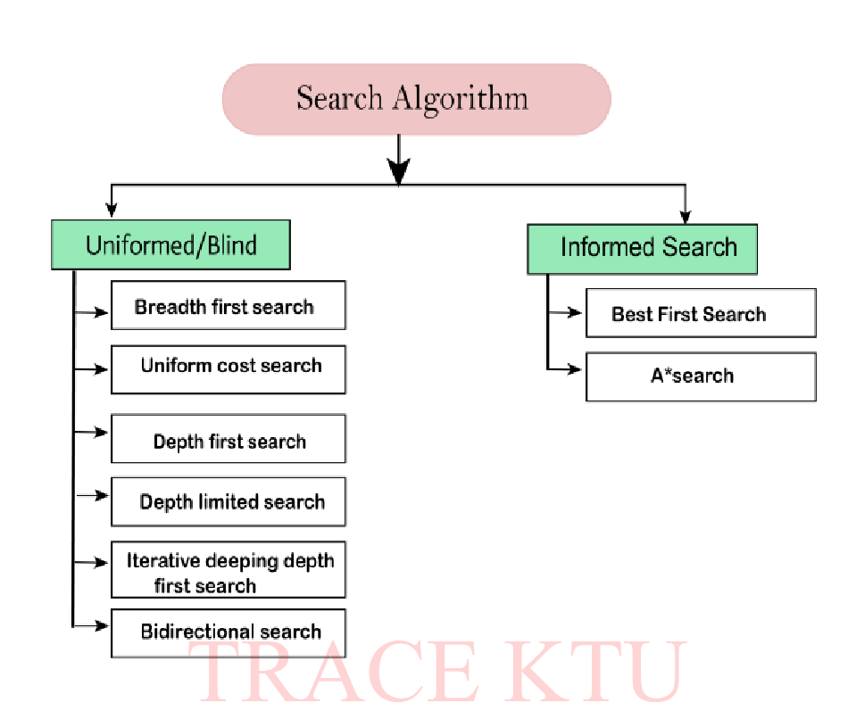

### Search Strategies

| Feature            | **Uninformed Search (Blind Search)**                 | **Informed Search (Heuristic Search)**                       |
| ------------------ | ---------------------------------------------------- | ------------------------------------------------------------ |
| **Knowledge used** | Only problem definition (start, goal, actions)       | Uses additional info — heuristic (estimate of goal distance) |
| **Guidance**       | Explores blindly (no idea which direction is better) | Guided towards goal using heuristic                          |
| **Examples**       | BFS, DFS, DLS, IDS, Uniform Cost                     | Greedy Best-First, A*, Hill Climbing                         |
| **Efficiency**     | Slower, explores large parts of state space          | Faster, fewer nodes expanded                                 |
| **Optimality**     | BFS and UCS → optimal; DFS not                       | A* is optimal if heuristic is admissible                     |
| **Memory use**     | Usually high (BFS) or low (DFS)                      | Depends on algorithm and heuristic                           |

---

## 🧠 **Search Algorithms Overview**

AI search algorithms help an agent **find a path** from a **start state** to a **goal state**.
They’re mainly divided into two categories based on what kind of knowledge they use:
**Uninformed (Blind)** and **Informed (Heuristic)** searches.

---

## 🌿 **1️⃣ Uninformed / Blind Search**

👉 These algorithms **don’t use any extra knowledge** about the goal.
They explore the search space **systematically** — either level by level or deep down first.

| Algorithm                           | Description                                                             | Notes                                               |
| ----------------------------------- | ----------------------------------------------------------------------- | --------------------------------------------------- |
| **Breadth-First Search (BFS)**      | Explores all nodes level by level.                                      | Complete & Optimal (if all step costs equal).       |
| **Uniform Cost Search (UCS)**       | Expands the least-cost node first (based on path cost *g(n)*).          | Always optimal for positive costs.                  |
| **Depth-First Search (DFS)**        | Explores as deep as possible before backtracking.                       | Memory efficient but not optimal.                   |
| **Depth-Limited Search (DLS)**      | DFS but stops after a fixed depth *L*.                                  | Prevents infinite loops.                            |
| **Iterative Deepening DFS (IDDFS)** | Repeats DFS with increasing depth limits.                               | Combines DFS’s low memory with BFS’s completeness.  |
| **Bidirectional Search**            | Runs two searches — one from start and one from goal — until they meet. | Fast but requires both directions to be searchable. |

💬 **Use when:** You have no clue which direction is best (e.g., maze solving without hints).

---

## 🌟 **2️⃣ Informed Search (Heuristic Search)**

👉 These algorithms use **heuristic functions (h(n))** — an *estimate* of how close you are to the goal.
They’re *smarter* and expand only promising paths.

| Algorithm             | Description                                                         | Notes                                          |
| --------------------- | ------------------------------------------------------------------- | ---------------------------------------------- |
| **Best-First Search** | Expands the node that appears closest to goal based on *h(n)*.      | Fast but not always optimal.                   |
| **A*** **Search**     | Combines cost so far *g(n)* + heuristic *h(n)* → *f(n) = g(n)+h(n)* | Optimal & Complete if heuristic is admissible. |

💬 **Use when:** You have a heuristic (e.g., distance, misplaced tiles) — helps find shortest paths efficiently.

---

### 🎯 **In short**

* **Uninformed:** No clue — search everything.
* **Informed:** Uses clues — guided by heuristic.

---

